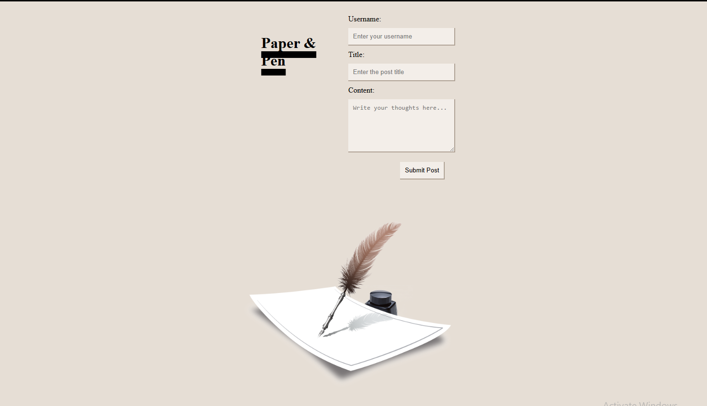

# Paper & Pen 

## Table of Contents
- [Description](#description)
- [Installation](#installation)
- [Usage](#usage)
- [Questions](#questions)

## Description
Paper and Pen is an app that lets you talk within a blog setting, displays bubbles of what you wrote in the login page. you can see anybody elses posts as well.

## Installation
by downloading the github demo and cloning it into your terminal.

## Usage
Enter your username and create your post by including both title and content and viola, you get sent to a blog page where you will see your post and anybody elses.

## Questions
For any questions, you can reach me at:
- GitHub: [MIKEYP53](https://github.com/MIKEYP53)
- Email: mprz646@gmail.com